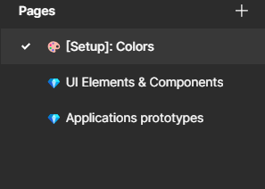
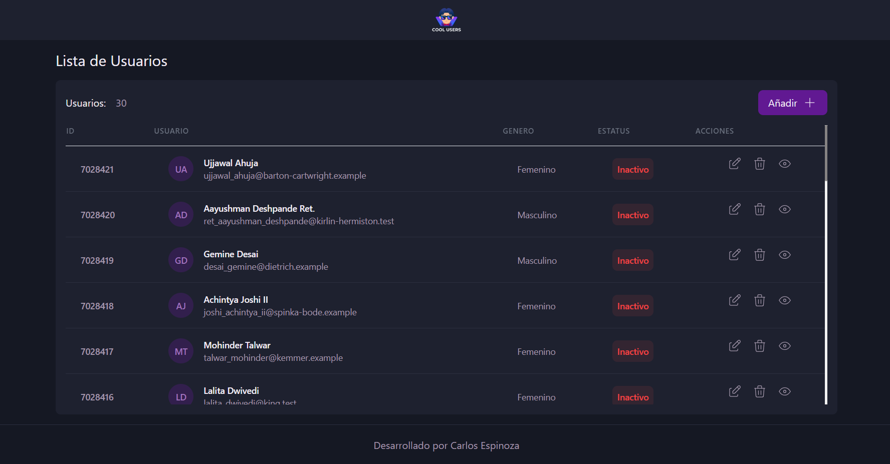
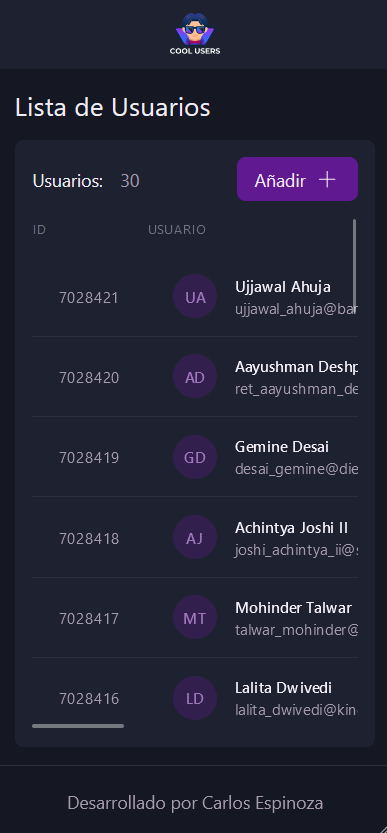
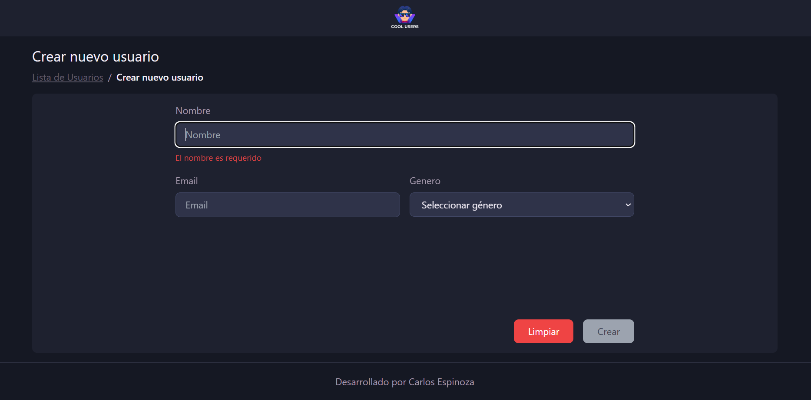
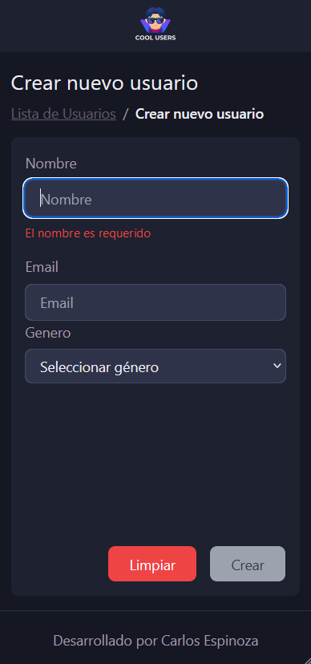
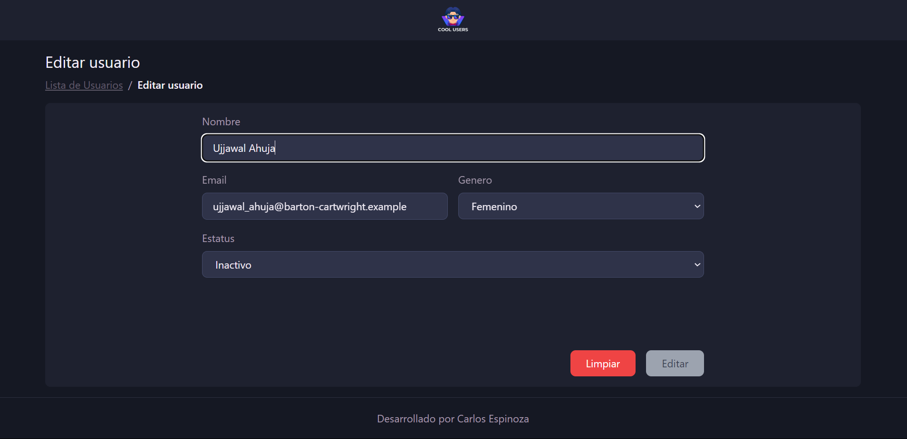
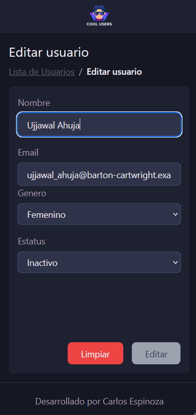

# CRUD User - Prueba Técnica

## Tabla de contenidos

- [Enlaces](#enlaces)
- [Mi proceso](#mi-proceso)
  - [Construido con](#construido-con)
  - [Propuesta de Diseño](#rpropuesta-diseño)
- [Flujo de Tabajo](#flujo-de-trabajo)
- [Autor](#autor)

CRUD Users es una aplicación web responsiva desarrollada con Vite y TypeScript que permite la gestión de usuarios a través de una interfaz intuitiva. La aplicación incluye funcionalidades para crear, leer, actualizar y eliminar usuarios, utilizando una API RESTful para manejar los datos.

## Enlace del Sitio en Vivo

- Demo: [CRUD Users](https://carlos-espipliego.github.io/PruebaT-CRUDUsers/)

## Mi proceso

### Tecnologías utilizadas:

- React
- Vite
- Typescript
- Redux Toolkit
- Tailwind CSS
- React-Router-Dom v6
- Sass
- Axios
- Formik & Yup
- SweetAlert2
- Tabler Icons

### Propuesta de Diseño:

La propuesta de diseño fue realizada en Figma, y se puede visualizar en el siguiente enlace: [Propuesta de Diseño](https://www.figma.com/design/qRh2mBH8wmvgm6dFLOykr3/PRUEBA-TECNICA?m=auto&t=WxLp3kwQVHzPlDYy-1)

El proyecto en Figma consta de 3 páginas: Colors, UI Elements & Components y Applications prototypes como se muestra en la siguiente imagen:

### Maquetación:

Listado de usuarios:
 

Agregar Usuarios:
 

Editar Usuarios:
 

## Flujo de Trabajo

Para este proyecto no se utilizó GitFlow, pero se siguió un flujo de trabajo similar. Se crearon las siguientes ramas:

- `main`: Rama principal del proyecto.
- `develop`: Rama de desarrollo, donde se unen las funcionalidades de las diferentes ramas de funcionalidades.
- `feature/feature-name`: Ramas de funcionalidades, donde se desarrollan las funcionalidades del proyecto.

El flujo de trabajo consistió en desarrollar características en ramas de funcionalidad individuales, probarlas y luego fusionarlas en la rama de desarrollo antes de finalmente fusionarlas en la rama principal.

## Autor

- GitHub - [@Carlos-EspiPliego](https://github.com/carlos-espipliego)
- GitHub Anterior - [@CarlosEspiPliego](https://github.com/carlosespipliego)
- Portfolio Web - [Portfolio](https://carlos-espipliego.github.io/portfolio-web/)
- LinkedIn - [Carlos Espipliego](https://www.linkedin.com/in/CarlosEspiPliego/)
- Frontend Mentor - [@GalaxyPliego](https://www.frontendmentor.io/profile/carlosespipliego)
